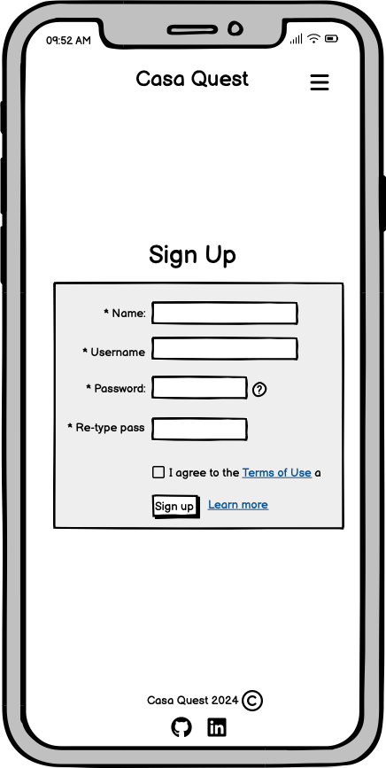
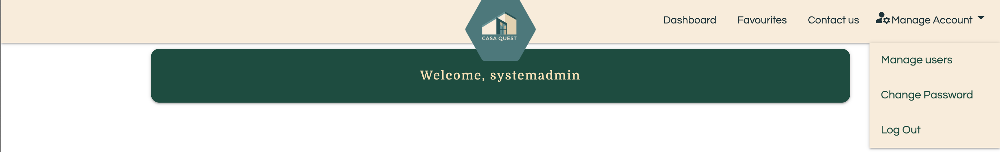
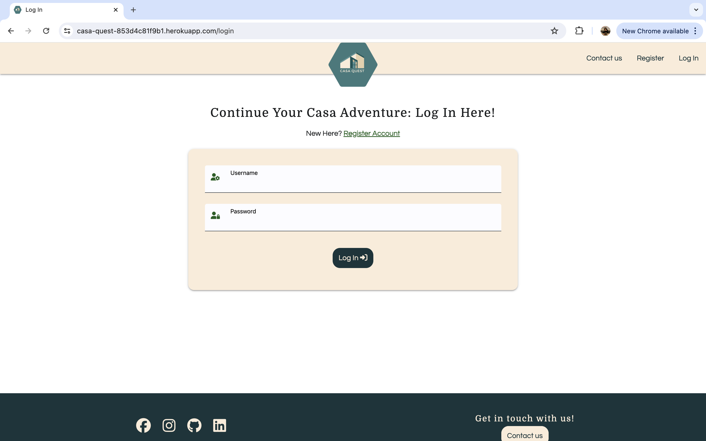
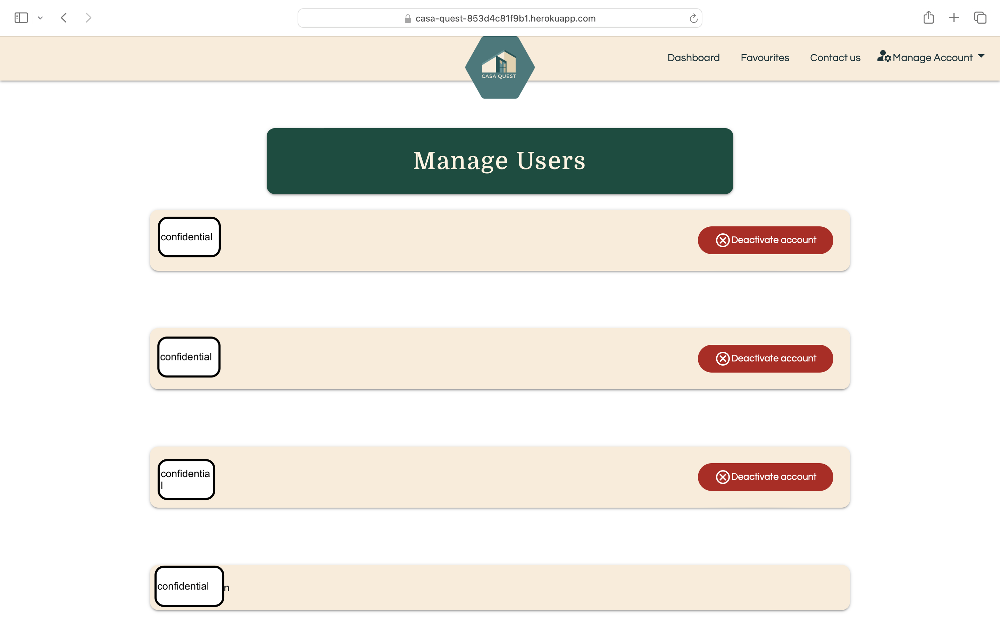
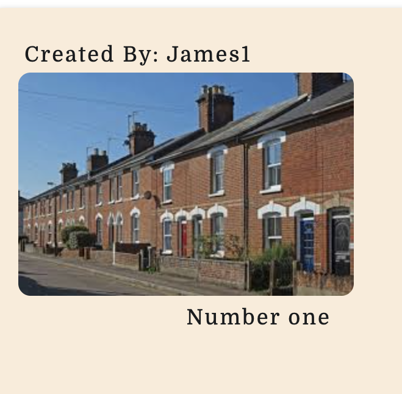

# [CASA QUEST](https://casa-quest-853d4c81f9b1.herokuapp.com)

[](https://github.com/mikavir/casa-quest/commits/main)
[](https://github.com/mikavir/casa-quest/commits/main)
[](https://github.com/mikavir/casa-quest)


source: [amiresponsive](https://ui.dev/amiresponsive?url=https://casa-quest-853d4c81f9b1.herokuapp.com)

**Casa Quest: Your Ultimate House-Hunting Adventure Begins Here!**

Introducing a responsive web app for house-hunters to efficiently organize and track properties. Users can create personalized accounts, curate dashboards with viewed and upcoming houses, and utilize built-in tools for comparing properties, streamlining the house-hunting process.

## UX

The inspiration for this idea came from my recent house-hunting experiences. Faced with a substantial amount of data for each property, I initially organized it manually using pen and paper. However, I soon realized the potential for a more efficient digital solution. This led me to develop this app, designed to streamline the process and enhance the user experience.

The target audience for this application is people who are actively purchasing homes, aiming to avoid any unforeseen surprises during the buying process. To enhance the user experience (UX) and design, I extensively researched various house-buying websites, including [RightMove](https://www.rightmove.co.uk/) and [Zoopla](https://www.zoopla.co.uk/). I found the design of [Mr and Mrs Clarke](https://www.mrandmrsclarke.com/) particularly inspiring. The goal of this project is to improve data organization and elevate the overall UX, making the house-hunting journey smoother and more enjoyable.

### Colour Scheme

Initially, these colours were selected to complement our logo. The shades of green and their corresponding hues were chosen for their association with tranquility and harmony. This makes them ideal for a website dedicated to house hunters searching for their perfect, peaceful home.

- Primary Color: rgb(250, 236, 217) - Hex: #FAECD9
- Secondary Color: rgb(88, 126, 123) - Hex: #587E7B
- Tertiary Color: rgb(253, 253, 253) - Hex: #FDFDFD
- Accent Color: rgb(23, 53, 59) - Hex: #17353B


I used [coolors.co](https://coolors.co/faecd9-587e7b-fdfdfd-17353b) to generate my colour palette.


As I developed my project, I discovered additional colors from the Materialize library that complemented my existing color scheme.

- #004d40 teal darken-4
- #00796b teal darken-2
- #ffe0b2 orange lighten-4

In total, these were the colours that made the website.

[coolors.co](https://coolors.co/fdfdfd-faecd9-ffe0b2-587e7b-00796b-004d40-17353b)


This was the colour taken from materialize web for cancel buttons: 

- #b71c1c red darken-4


[coolors.co](https://coolors.co/b71c1c)

### Typography

After researching other home buying websites and gathering ideas, I found significant inspiration in the design of the [Mr and Mrs Clarke](https://www.mrandmrsclarke.com/) website. The fonts used in the website have been inspired from the fonts that they have used.


- [Domine](https://fonts.google.com/specimen/Domine) was used for the primary headers and titles.

- [Questrial](https://fonts.google.com/specimen/Questrial) was used for all other secondary text.

- [Material Icons](https://fonts.google.com/icons?icon.set=Material+Icons) was used for icons from Materialize web.

- [Font Awesome](https://fontawesome.com) icons were used throughout the site, such as the social media icons in the footer.

## User Stories

### New Site Users

- As a new site user, I would like to see a clear logo, so that I can remember the brand.
- As a new site user, I would like to see a clear message of the web app, so that I can understand the web application well.
- As a new site user, I would like to see a navigation bar, so that I can easily navigate around the site.
- As a new site user, I would like to see a contact page, so that I can get in touch with the administrators of the application if I need help.
- As a new site user, I would like to see social media icons so that I can reach out to other sources.

### Returning Site Users

- As a returning site user, I would like to be able to register so that I can have a personal account.
- As a returning site user, I would like to be able to log in once registered, so that I can keep a track of properties visited.
- As a returning site user, I would like to be able to make new entries of properties, so that I can keep a log of my properties.
- As a returning site user, I would like to edit the information so that I can have more accurate information on the property.
- As a returning site user, I would like to delete the entry, so that I can eliminate properties that I'm not interested.
-  As a returning site user, I would like to see a community of homebuyers so that I can learn more about buying houses.
- As a returning site user, I would like to be able to make a post in the community of homebuyers, so that I can share my experience.
- As a returning site user, I would like to be able to make a comment in a post in the community of homebuyers, so that I can share my experience.
- As a returning site user, I would like to be able to change my password, so that I can keep my account secure.
- As a returning site user, I would like to be able to mark some properties as my favourite so that I can keep track of my top choices. 
- As a returning site user, I would like to be able to see all the properties that I have added in one page so I can easily compare them.
- As a returning site user, I would like to be able to log out to keep my session secure from who will be using the same device as me.
- As a returning site user, I would like to be able to see a map of the location of the house so I can see the facilities nearby.
- As a returning site user, I would like the ability to access a dedicated page for each house, allowing me to add and view detailed information specific to that property.
- As a returning site user, I would like the ability to add information on that specific property.
- As a returning site user, I would like the ability to edit information on that specific property.

### Site Admin

- As a site administrator, I would like to keep connected with my users so that they can report any user experience.
- As a site administrator, I should be able to delete posts that are against the rules so that I can ensure that the community is safe.
- As a site administrator, I should be able to delete users that is violating the rules, so that I can ensure that the community is safe.
- As a site administrator, I need to manage and view user accounts effectively to ensure control over the user base and monitor user activity.
- As a site administrator, I should be able to direct users back to home if they have reached a page that is not found.
- As a site administrator, I should be able to direct users back to home if they have reached a page that is forbidden to access.
- As a site administrator, I should be able to direct users back to home if the web application has reached an internal server error.

## Wireframes

To follow best practice, wireframes were developed for mobile, tablet, and desktop sizes.
I've used [Balsamiq](https://balsamiq.com/wireframes) to design my site wireframes.

### Mobile Wireframes

<details>
<summary> Click here to see the Mobile Wireframes </summary>

Landing Page
  - 

Profile
  - 

House Post
  - 

Login
  - 

Register
  - 

Contact
  - 

Blog
  - 
</details>

### Tablet Wireframes

<details>
<summary> Click here to see the Tablet Wireframes </summary>

Landing Page
  - 

Profile
  - 

House Post
  - 

Login
  - 

Register
  - 

Contact
  - 

Blog
  - 

</details>

### Desktop Wireframes

<details>
<summary> Click here to see the Desktop Wireframes </summary>

Landing Page
  - 

Profile
  - 

House Post
  - 

Login
  - 

Register
  - 

Contact
  - 

Blog
  - 


</details>

## Features

### Existing Features
> [!NOTE]
> The addresses and usernames shown below are not associated with any individuals; they are random placeholder addresses used solely for testing purposes. User privacy and confidentiality have been maintained and strictly adhered to throughout the testing procedure.

- **Logo**

    - The logo displays a house next to the web application's name, forging an immediate connection with house-hunting. This strategic approach effectively targets the intended audience and plays a vital role in solidifying the brand identity. Users swiftly recognize and associate the logo with the platform's fundamental purpose.


- **Landing Page**

    - The landing page creates the first impression of the website, conveying the core message and purpose of the web application. It establishes the theme for the entire site and strengthens the brand image. Featuring a hero image of a family, it suggests the idea of families finding a home together, enhancing the emotional connection with visitors.


- **Call out message and button**

    - Having a callout button simplifies navigation by prompting users to take action. For example, the 'Start Your Casa Quest Now' button encourages users to create an account.


- **Dashboard**

    - Offering a dashboard displaying houses with essential details centralizes access to property information. Users can effortlessly view all relevant details about different properties in a single location, eliminating the need to navigate between multiple pages. This streamlined setup facilitates swift and straightforward comparison of multiple properties based on criteria like price, location, number of bedrooms, and features.


- **Favourite**

    - Users can mark properties as favourites, which then appear on a dedicated favourites page for easy access and review. This feature allows users to keep all their preferred properties in one place, simplifying the management and review process. By maintaining a favourites list, users can quickly compare their top choices without needing to search for them again


- **Navigation bar**

    - The presence of a navigation bar is crucial as it provides users with a clear pathway to navigate through the website, ensuring easy access to desired pages.



- **Social Media Links in footer**

    - Adding social media links enhances brand identity and builds trust by expanding points of contact.


- **Authentication**

    - Manage Account

        - A centralized place to manage account settings reduces complexity, making it easy for users to update their password or logout.

      

    - Change Password

        - Implementing a password change feature will enhance profile security by enabling users to update their passwords regularly. Additionally, the passwords must meet stringent security requirements.

      

    - Registration Page

        - A registration page enables users to securely create an account, providing them with a dedicated space to save their property searches. This ensures convenient access and allows for easy review whenever needed, enhancing the overall user experience.

      

    - Log in Page

        - Having a login page allows users to easily return to their accounts. This enables them to access their saved property searches, ensuring convenient and quick review whenever needed

      

    - Log out button

      - Users have the ability to log out from their accounts. This logout button plays a critical role in ensuring the security and privacy of user accounts. By logging out, users effectively terminate their current session, preventing unauthorized access to their account by others who might have access to the same device. 

      

- **Contact page**

    - Having a contact page allows users to easily get in touch with the admin. This enables them to reach out for assistance with account maintenance or to report any bugs. A contact page enhances trust in the website, making users feel more at ease.


- **House**

    - A dedicated page for house information contains all the necessary questions and forms to capture comprehensive details about the property.


- **Add House**

    - Introducing a dedicated page for users to add new houses enhances platform functionality and user experience significantly.


- **Edit a house**

    - Allowing users to edit the information they've provided is crucial for ensuring accuracy and relevance over time. This feature empowers users to keep their property details up-to-date, reflecting any changes accurately. It enhances user experience by offering flexibility and control, fostering a sense of ownership and satisfaction with the platform.


- **Embedded map of the house**

    - Users can view a map of the house they've inputted, enabling them to visualize the property's surroundings and nearby facilities. This feature enhances their decision-making process by providing valuable insights into the neighborhood, nearby amenities, and accessibility, ultimately aiding in finding the ideal property.


- **Add house details button**

    - This button serves to activate modals featuring forms essential for house viewing, providing house information, and conducting house checks during property inspections. The modal prompts users to input additional information, ensuring clarity by specifying which add button corresponds to each form. This intuitive design streamlines the process, guiding users efficiently through the necessary steps and enhancing their experience.


- **Edit House details button**

    - This button activates modals containing essential forms for updating house information and making adjustments during property inspections. These modals prompt users to modify additional details, empowering them with the flexibility to provide accurate and up-to-date information at any time.


- **Delete house button and delete house modal**

    - Users have the ability to delete houses they've created by using the 'x' button. Upon clicking, a modal prompts them to confirm the deletion, preventing accidental removals. This confirmation step ensures users are fully aware that deleting a house will permanently remove all associated data. This feature enhances user control while safeguarding against unintended data loss.


- **Auto-reply**

    - When a user contacts the admin through the contact page, they receive an immediate auto-reply. This ensures that users receive prompt feedback, confirming their message has been received.


- **'404' page**

    - A '404' significantly enhances user experience by guiding users back to relevant content, reducing frustration, and improving site navigation


- **'403' page**

    - A '403' enhances user experience and security. When users encounter restricted access, a well-designed 403 page clearly communicates that the content is off-limits, reducing confusion and frustration. 


- **'500' page**

    - A '500' enhances user experience and maintains trust during server errors. When users encounter an internal server error, a well-designed 500 page reassures them that the issue is recognized and being addressed, reducing frustration. This page supports consistent branding and professionalism, ensuring the site's look and feel are maintained even during technical difficulties.


### Admin Features
- **Manage Users**

    - Admins have the ability to manage users by monitoring the total number of users on the platform. This feature enables admins to assess user activity and growth, providing valuable insights into the platform's performance.



- **Deactivate user account**

    - Admins have the ability to deactivate user accounts. This feature allows them to respond to user requests for account deletion and manage users who violate the platform's rules. By providing this functionality, admins can ensure compliance with user preferences and maintain a safe, respectful community environment A modal prompts admin to confirm their deletion, preventing accidental account deletions.


- **'Created By'**

    - Admins have the ability to identify the creators of posts. This functionality allows them to monitor user activity and take appropriate action against users who violate the platform's guidelines or misuse the web application.





### Future Features

- Blog commmunity
    - As indicated in the database below, my initial plan was to incorporate a blog community as an additional feature for this project. However, integrating this feature at this stage would deviate from the minimum viable product (MVP) and consume valuable time that could be better utilized for rigorous testing and establishing a robust foundation for the project. Consequently, I made the challenging decision to prioritize the MVP and postpone the implementation of this feature for future consideration.
- Customised questions
    - A feature where users can create their own custom questions and inputs alongside the predetermined ones. This empowers users in their house-hunting journey, enabling them to include criteria that they prioritize personally. However, this feature is earmarked for future implementation, as it may necessitate a more robust database to efficiently store these user-generated questions.


## Tools & Technologies Used
- [](https://tim.2bn.dev/markdown-builder) used to generate README and TESTING templates.
- [](https://balsamiq.com/wireframes) used for creating wireframes.
- [](https://git-scm.com) used for version control. (`git add`, `git commit`, `git push`)
- [](https://github.com) used for secure online code storage.
- [](https://gitpod.io) used as a cloud-based IDE for development.
- [](https://en.wikipedia.org/wiki/HTML) used for the main site content.
- [](https://en.wikipedia.org/wiki/CSS) used for the main site design and layout.
- [](https://www.javascript.com) used for user interaction on the site.
- [](https://jquery.com) used for user interaction on the site.
- [](https://www.python.org) used as the back-end programming language.
- [](https://www.heroku.com) used for hosting the deployed back-end site.
- [](https://materializeweb.com) used as the front-end CSS framework for modern responsiveness and pre-built components.
- [](https://flask.palletsprojects.com) used as the Python framework for the site.
- [](https://www.mongodb.com) used as the non-relational database management with Flask.
- [](https://cloudinary.com) used for online static file storage.
- [](https://www.canva.com/p/canvawireframes) used for creating logo.
- [](https://developers.google.com/maps) used as an interactive map on my site.
- [](https://fontawesome.com) used for the icons.
- [](https://fonts.google.com/icons) used for the icons and fonts.
- [](https://chat.openai.com) used to make the writing content.
- [](https://www.emailjs.com/) used to send automatic replies to user after contacting.
- [](https://www.adobe.com/express/) used to convert screen recording into gifs for documentation.


## User Pathway
Using Lucidchart, I have illustrated the user pathways as shown below.


## Database Design

The data used for Casa Quest was inspired by a list of questions my partner and I compiled while viewing houses. Initially, we organized these questions into a comprehensive table shown below. 
The idea emerged to transform the table into a more digital, user-friendly format with organized data.


My project utilizes MongoDB, a non-relational database. Despite MongoDB's non-relational nature, there are established relations within this database, particularly with users owning a 'house' and each house 'having' associated information, as depicted in the ERD below crafted from [Mermaid](https://mermaid.js.org/syntax/entityRelationshipDiagram.html). MongoDB's document-based data model offers a flexible schema design. This flexibility proves advantageous when handling entities like houses, accommodating varying attributes or additional information seamlessly without having to change to the entire schema.


My database is called **casa_quest**.

It contains 5 collections:

- **users**
- **house**
- **houseInformation**
- **houseChecks**
- **houseViewing**

Initially, I did have seven collections to accomodate for the feature of a blog. However I realized that the Minimum Viable Product (MVP) should focus on organizing house information rather than creating blog posts. This insight led me to eliminate the blog post feature and concentrate on achieving the core MVP. Below was the initial ERD of my project using [Lucid chart](www.lucidchart.com).


## Agile Development Process

### GitHub Projects

[GitHub Projects](https://github.com/mikavir/casa-quest/projects) served as an Agile tool for this project.
It isn't a specialized tool, but with the right tags and project creation/issue assignments, it can be made to work.

Through it, issues and tasks were planned, then tracked on a weekly basis using the basic Kanban board.


### GitHub Issues

[GitHub Issues](https://github.com/mikavir/casa-quest/issues) served as an another Agile tool.


- [Open Issues](https://github.com/mikavir/casa-quest/issues) [](https://github.com/mikavir/casa-quest/issues)

    

- [Closed Issues](https://github.com/mikavir/casa-quest/issues?q=is%3Aissue+is%3Aclosed) [](https://github.com/mikavir/casa-quest/issues?q=is%3Aissue+is%3Aclosed)

    


## Testing

> [!NOTE]  
> For all testing, please refer to the [TESTING.md](TESTING.md) file.

## Deployment

The live deployed application can be found deployed on [Heroku](https://casa-quest-853d4c81f9b1.herokuapp.com).

### MongoDB Non-Relational Database

This project uses [MongoDB](https://www.mongodb.com) for the Non-Relational Database.

To obtain your own MongoDB Database URI, sign-up on their site, then follow these steps:

- The name of the database on MongoDB should be called **insert-your-database-name-here**.
- The collection(s) needed for this database should be **insert-your-collection-names-here**.
- Click on the **Cluster** name created for the project.
- Click on the **Connect** button.
- Click **Connect Your Application**.
- Copy the connection string, and replace `password` with your own password (also remove the angle-brackets).

### Heroku Deployment

This project uses [Heroku](https://www.heroku.com), a platform as a service (PaaS) that enables developers to build, run, and operate applications entirely in the cloud.

Deployment steps are as follows, after account setup:

- Select **New** in the top-right corner of your Heroku Dashboard, and select **Create new app** from the dropdown menu.
- Your app name must be unique, and then choose a region closest to you (EU or USA), and finally, select **Create App**.
- From the new app **Settings**, click **Reveal Config Vars**, and set your environment variables.

> [!IMPORTANT]  
> This is a sample only; you would replace the values with your own if cloning/forking my repository.

| Key | Value |
| --- | --- |
| `IP` | 0.0.0.0 |
| `PORT` | 5000 |
| `SECRET_KEY` | user's own value |
| `MONGO_URI` | user's own value |
| `MONGO_DBNAME` | user's own value |
| `CLOUDINARY_CLOUD_NAME` | user's own value |
| `CLOUDINARY_API_SECRET` | user's own value |
| `CLOUDINARY_API_KEY` | user's own value |
| `EMAIL_API` | user's own value |
| `MAPS_API` | user's own value |

Heroku needs three additional files in order to deploy properly.

- requirements.txt
- Procfile
- runtime.txt

You can install this project's **requirements** (where applicable) using:

- `pip3 install -r requirements.txt`

If you have your own packages that have been installed, then the requirements file needs updated using:

- `pip3 freeze --local > requirements.txt`

The **Procfile** can be created with the following command:

- `echo web: python app.py > Procfile`
- *replace **app.py** with the name of your primary Flask app name; the one at the root-level*

The **runtime.txt** file needs to know which Python version you're using:
1. type: `python3 --version` in the terminal.
2. in the **runtime.txt** file, add your Python version:
	- `python-3.9.18`

For Heroku deployment, follow these steps to connect your own GitHub repository to the newly created app:

Either:

- Select **Automatic Deployment** from the Heroku app.

Or:

- In the Terminal/CLI, connect to Heroku using this command: `heroku login -i`
- Set the remote for Heroku: `heroku git:remote -a app_name` (replace *app_name* with your app name)
- After performing the standard Git `add`, `commit`, and `push` to GitHub, you can now type:
	- `git push heroku main`

The project should now be connected and deployed to Heroku!

### Obtaining EmailJS API 

1. Sign up for a [EmailJS](https://www.emailjs.com/docs/) account in the EmailJS website.
2. Create an email service in your EmailJS dashboard.
3. Install EmailJS Library. You can do this by including the EmailJS script in your HTML file or by installing it via npm if you're using a package manager like npm or yarn.

```
npm install --save @emailjs/browser
```

or

```
$ yarn add @emailjs/browser
```

4. In your EmailJS dashboard, navigate to the "API Keys" section and copy your API key.
5. Add this code snippet before your closing tags. Making sure you have added your public key.

```js
<script type="text/javascript"
        src="https://cdn.jsdelivr.net/npm/@emailjs/browser@4/dist/email.min.js">
</script>
<script type="text/javascript">
  (function(){
      emailjs.init({
        publicKey: "YOUR_PUBLIC_KEY",
      });
  })();
</script>
```

6.  Create an email template in your EmailJS dashboard. This template will define the content and structure of the emails you'll send.
7. Write JavaScript function to send email using EmailJS. Below is a basic syntax for the code: 

```
emailjs.send(serviceID, templateID, templateParams, options);
```

8. Call your function whenever you want to send an email.

### Obtaining EmbedMaps API 

1. Create a Google Cloud Platform account at [Google Cloud](https://cloud.google.com/?hl=en)
2. Set up a new project in the Google Cloud Console.
3. Enable the required Google Maps APIs from the “API & Services” dashboard.
4. Create API credentials and generate an API key and enable 'Embed Maps API'
5. Optionally restrict the API key for security under “Application restrictions” and “API restrictions.”
6. Set up billing in the Google Cloud Console.
7. Set up your API Key in your env.py
```python

os.eviron.get("MAPS_API", "user's own value")

```
8. Integrate it into your Flask app:
```python

parameters = address

maps_api = os.environ.get('MAPS_API')

embed_url = f"https://www.google.com/maps/embed/v1/place?key={maps_api}&q={parameters}"

```
9. If deployed to Heroku, Add the API key to the config vars

### Obtaining Cloudinary API
1. Sign Up at Cloudinary and verify your email.
2. Log In to your Cloudinary account.
3. Find Your API Credentials in the dashboard (Cloud name, API Key, and API Secret).
4. Install the Cloudinary Python SDK
```sh
pip3 install cloudinary
```
5. Add your Cloudinary API key to your env.py
```python
import os 

os.environ.setdefault("CLOUDINARY_CLOUD_NAME", "user's own value")
os.environ.setdefault("CLOUDINARY_API_KEY", "user's own value")
os.environ.setdefault("CLOUDINARY_API_SECRET", "user's own value")


```

6. Configure Cloudinary in your Python application:
```python
import os
import cloudinary 

cloudinary.config(
    cloud_name = os.environ.get('CLOUDINARY_CLOUD_NAME'),
    api_key = os.environ.get('CLOUDINARY_API_KEY'),
    api_secret = os.environ.get('CLOUDINARY_API_SECRET')
)
```
7. Integrate it with your flask app
```python
file = request.files["file"]

# Upload to cloudinary
file_upload = cloudinary.uploader.upload(file)

```

### Local Deployment

This project can be cloned or forked in order to make a local copy on your own system.

For either method, you will need to install any applicable packages found within the *requirements.txt* file.

- `pip3 install -r requirements.txt`.

You will need to create a new file called `env.py` at the root-level,
and include the same environment variables listed above from the Heroku deployment steps, plus a few extras.

> [!IMPORTANT]  
> This is a sample only; you would replace the values with your own if cloning/forking my repository.

Sample `env.py` file:

```python
import os

os.environ.setdefault("IP", "0.0.0.0")
os.environ.setdefault("PORT", "5000")
os.environ.setdefault("SECRET_KEY", "user's own value")
# Mongo
os.environ.setdefault("MONGO_DBNAME", "user's own value")
os.environ.setdefault("MONGO_URI", "user's own value")
# env credentials for cloudinary API
os.environ.setdefault("CLOUDINARY_CLOUD_NAME", "user's own value")
os.environ.setdefault("CLOUDINARY_API_KEY", "user's own value")
os.environ.setdefault("CLOUDINARY_API_SECRET", "user's own value")
# env credentials for google API
os.environ.setdefault('MAPS_API',"user's own value")
# env credentials for emailjs API
os.environ.setdefault('EMAIL_API', "user's own value")
# local environment only (do not include these in production/deployment!)
os.environ.setdefault("DEBUG", "True")
os.environ.setdefault("DEVELOPMENT", "True")
```


#### Cloning

You can clone the repository by following these steps:

1. Go to the [GitHub repository](https://github.com/mikavir/casa-quest) 
2. Locate the Code button above the list of files and click it 
3. Select if you prefer to clone using HTTPS, SSH, or GitHub CLI and click the copy button to copy the URL to your clipboard
4. Open Git shell or Terminal
5. Change the current working directory to the one where you want the cloned directory
6. In your IDE Terminal, type the following command to clone my repository:
	- `git clone https://github.com/mikavir/casa-quest.git`
7. Press Enter to create your local clone.

Alternatively, if using Gitpod, you can click below to create your own workspace using this repository.

[](https://gitpod.io/#https://github.com/mikavir/casa-quest)

Please note that in order to directly open the project in Gitpod, you need to have the browser extension installed.
A tutorial on how to do that can be found [here](https://www.gitpod.io/docs/configure/user-settings/browser-extension).

#### Forking

By forking the GitHub Repository, we make a copy of the original repository on our GitHub account to view and/or make changes without affecting the original owner's repository.
You can fork this repository by using the following steps:

1. Log in to GitHub and locate the [GitHub Repository](https://github.com/mikavir/casa-quest)
2. At the top of the Repository (not top of page) just above the "Settings" Button on the menu, locate the "Fork" Button.
3. Once clicked, you should now have a copy of the original repository in your own GitHub account!

### Local VS Deployment

There is no difference between the local version and the deployed version.

## Credits

### Content

| Source | Location | Notes |
| --- | --- | --- |
| [Markdown Builder](https://tim.2bn.dev/markdown-builder) | README and TESTING | Tool to help generate the Markdown files |
| [StackOverflow](https://stackoverflow.com/questions/67937305/how-to-get-the-size-of-a-multipart-form-data-binary-file) | app.py: `add_new_house()` and `edit_new_house()` | "How to find the size of an image upload" |
| [StackOverflow](https://stackoverflow.com/questions/42294/how-do-you-get-the-footer-to-stay-at-the-bottom-of-a-web-page) | entire site | How to bring the footer at the bottom of the HTML |
| [Mr and Mrs Clarke](https://www.mrandmrsclarke.com/) | entire site | Inspiration on the design |
| [study.com](https://study.com/learn/lesson/python-not-equal-conditional-operators.html#:~:text=Python%20Not%20Equal%20Operator,the%20return%20value%20is%20true.) | app.py | Conditional operations |
| [Code Academy](https://www.codecademy.com/learn/dscp-python-fundamentals/modules/dscp-python-dictionaries/cheatsheet) | app.py: `delete_user(username, user_name)` | To access the house_id key in the dictionary |
| [Geek for geeks](https://www.geeksforgeeks.org/how-to-search-for-an-object-by-its-objectid-in-the-mongo-console/) | app.py | How to searh for object id in mongo |
| [w3 schools](https://www.w3schools.com/python/ref_list_append.asp) | app.py | How to append to make a list |
| [Cloudinary](https://cloudinary.com/blog/creating_an_api_with_python_flask_to_upload_files_to_cloudinary) | app.py | Using cloudinary to store user images and using the url created |
| [Flasks docs](https://flask-docs-ja.readthedocs.io/en/latest/patterns/errorpages/) | app.py | Making routes for error pages |
| [Google Cloud](https://developers.google.com/maps/documentation/embed/get-started) | app.py | Documentation on Embed maps API |
| [Flask](https://flask.palletsprojects.com/en/2.3.x/tutorial/templates/) | All templates | Adding titles using jinja syntax on templates |
| [W3 Schools](https://www.w3schools.com/tags/att_input_pattern.asp) | Registration page, login page and change password page | Adding pattern requirements on passwords |
| [StackOverflow](https://stackoverflow.com/questions/3974985/update-mongodb-field-using-value-of-another-field) | app.py | Updating mongodb using field of another field|
| [Tedboy](https://tedboy.github.io/flask/generated/werkzeug.check_password_hash.html) | app.py | Documentation on check_password_hash|
| [StackOverflow](https://stackoverflow.com/questions/28968660/how-to-convert-a-pymongo-cursor-cursor-into-a-dict) | app.py | How to convert a mongodb curser to a list of dictionary|
| [w3 schools](https://www.w3schools.com/tags/ref_urlencode.ASP) | entire site | used to debug url and the routes|
| [Migelgrinberg](https://blog.miguelgrinberg.com/post/handling-file-uploads-with-flask) | app.py | Handling File Uploads With Flask|
| [StackOverflow](https://stackoverflow.com/questions/572768/styling-an-input-type-file-button) | styles.css | Styling an input type file button|
| [Youtube](https://www.youtube.com/watch?v=J39KJ5jzH3E) | app.py | How to add google autocomplete |
| [shecodes.io](https://www.shecodes.io/athena/264269-how-to-order-a-list-vertically-using-css#:~:text=list%20and%20set%20the%20display,items%20vertically%20in%20a%20column.&text=This%20will%20order%20the%20list%20items%20vertically%20instead%20of%20horizontally.) | styles.css | How to order a list vertically |
| [Great Wall of Gratitude](https://github.com/VCGithubCode/Gratidudes) | styles.css | How to create a toggle animation of hamburger to x sign. |
| [mikavir](https://github.com/mikavir/rx-decoder) | contact page, email.js | Setting up the emailjs and contact page |
| [StackOverflow](https://stackoverflow.com/questions/25184310/first-name-validation-using-html-5-pattern) | registration page| Name requirement |
| [Flask](https://flask.palletsprojects.com/en/2.3.x/patterns/viewdecorators/) | app.py | Ensure user is logged in |
| [w3 schools](https://www.w3schools.com/python/ref_string_isalnum.asp) | registration page | Form validation |
| [Stack Overflow](https://stackoverflow.com/questions/67937305/how-to-get-the-size-of-a-multipart-form-data-binary-file) | app.py | File validation |
| [Stack Overflow](https://www.w3schools.com/howto/howto_js_toggle_password.asp) | Login, Change_password and register page | Toggle password function |
| Tim Nelson | script.js | Fixing materialize select bug, calculating 3 months for datepicker |

### Media

| Source | Location | Type | Notes |
| --- | --- | --- | --- |
| [FreePik](https://www.freepik.com/free-photo/back-view-family-hugging-admiring-their-home_22426721.htm#query=house&position=49&from_view=keyword&track=sph&uuid=6f9398b1-ef01-41fa-912d-7c88cb9c1d84") | Landing Page |Image | Hero image background- Image by zinkevych |
| [FreePik](https://www.freepik.com/free-photo/full-shot-woman-with-cute-greyhound-dog_38898080.htm#fromView=search&page=1&position=52&uuid=9ddc6669-3e79-4dc2-a09c-c84210518efc) | Landing Page | image | Image |
| [Pexels]( https://www.pexels.com/photo/house-lights-turned-on-106399/) | House | placeholder image of a house | Photo by Binyamin Mellish |
| [Pexels](https://www.pexels.com/photo/beige-bungalow-house-259588/) | House | Placeolder | Photo by Pixabay |
| [Canvas](https://www.canva.com/) | Logo | Logo | Personalised logo |


### Acknowledgements

- I would like to thank my Code Institute mentor, [Tim Nelson](https://github.com/TravelTimN) for his support throughout the development of this project.
- I would like to thank my Code Insititute Cohort Facilitator Amy for answering all my questions promptly and boosting my confidence.
- I would like to thank a few individuals from my cohort for helping me fight against imposter syndrome and giving feedback on my project.
- I would like to thank the [Code Institute Slack community](https://code-institute-room.slack.com) for the moral support; it kept me going during periods of self doubt and imposter syndrome.
- I would like to thank my partner Jon, for being my rubber duck when I need to debug.

