# Testing

> [!NOTE]  
> Return back to the [README.md](README.md) file.

## Code Validation
### HTML
I have used the recommended [HTML W3C Validator](https://validator.w3.org) to validate all of my HTML files.

These are the files that I was able to validate using the url as the others needed to be logged in to be accessed.
| Validator| File | Screenshot | Notes |
| --- | --- | --- | --- |
|[W3C Validator](https://validator.w3.org/nu/?showsource=yes&doc=https%3A%2F%2Fcasa-quest-853d4c81f9b1.herokuapp.com%2Fcontact)| contact.html |  | No errors found|
|[W3C Validator](https://validator.w3.org/nu/?showsource=yes&doc=https%3A%2F%2Fcasa-quest-853d4c81f9b1.herokuapp.com%2F)| index.html |  | No errors found|
|[W3C Validator](https://validator.w3.org/nu/?showsource=yes&doc=https%3A%2F%2Fcasa-quest-853d4c81f9b1.herokuapp.com%2Flogin)| login.html |  | No errors found|
|[W3C Validator](https://validator.w3.org/nu/?showsource=yes&doc=https%3A%2F%2Fcasa-quest-853d4c81f9b1.herokuapp.com%2Fregister)| register.html |  | No errors found|

These are the HTML files that I valdiated by copying and pasting the HTML code and tested it as a direct input.
| File | Screenshot | Notes |
| --- | --- | --- |
| profile.html |  | No errors found|
| favourites.html |  | No errors found|
| new_house.html |  | No errors found|
| edit_new_house.html |  | No errors found|
| house.html |  | No errors found|
| change_password.html |  | No errors found|
| manage_users.html |  | No errors found|
| 404.html |  | No errors found|
| 403.html |  | No errors found|
| 500.html |  | No errors found|

### CSS

I have used the recommended [CSS Jigsaw Validator](https://jigsaw.w3.org/css-validator) to validate all of my CSS files.

| Directory | File | Screenshot | Notes |
| --- | --- | --- | --- |
| static | style.css |   | No error on style.css file, errors marked from the libraries used |


### JavaScript

I have used the recommended [JShint Validator](https://jshint.com) to validate all of my JS files.

| Directory | File | Screenshot | Notes |
| --- | --- | --- | --- |
| static | script.js |  |  Undefined variable of `M` from materialize initiation |
| static | house.js | 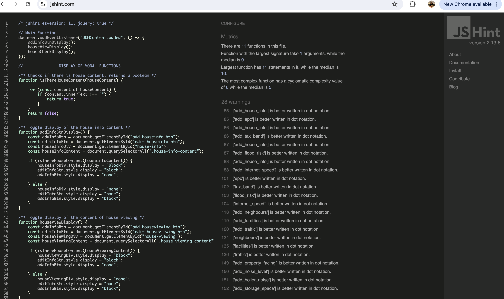 | Recommendations to use dot notation with my form validation function Fix: (second screenshot) I have changed it to dot notation as recommended. Unused functions called into house template|
| static | email.js |  | Undefined variable of `emailjs` and `M` from materialize. Unused variable of `sendmail`. This function was called in the contact.html|

I used separate script tags in certain HTML files to target only those specific id's in those pages.

| Directory | File | Screenshot | Notes |
| --- | --- | --- | --- |
| templates | profile.html |  |  No errors |
| templates | favourites.html |  | No errors |
| templates | new_house.html |  | Undefined variable of `google` from google API. Unused variable of `formValidation()`. This function will be called in once form is submitted.  Unused variable of `initAutoComplete()`. This function initialises google's autocomplete API. Recommendations to use dot notation with my form validation function Fix: (second screenshot) I have changed it to dot notation as recommended. |
| templates | edit_new_house.html |   | Undefined variable of `google` from google API. Unused variable of `formValidation()`. This function will be called in once form is submitted.  Unused variable of `initAutoComplete()`. This function initialises google's autocomplete API. Recommendations to use dot notation with my form validation function Fix: (second screenshot) I have changed it to dot notation as recommended. |
           

### Python

I have used the recommended [PEP8 CI Python Linter](https://pep8ci.herokuapp.com) to validate all of my Python files.

| Directory | File | CI URL | Screenshot | Notes |
| --- | --- | --- | --- | --- |
|  | app.py | [PEP8 CI](https://pep8ci.herokuapp.com/https://raw.githubusercontent.com/mikavir/casa-quest/main/app.py) |  | Some lines were too long to break due to being strings, Therefore, I added # noqa. |

## Browser Compatibility

I've tested my deployed project on multiple browsers to check for compatibility issues. As my project contains many pages, I will be splitting it into two tables
| Browser | Landing page(index) | Register | Log in  | Profile | House | Contact | Favourites | Notes |
| --- | --- | --- | --- | --- | --- | --- | --- | --- |
| Chrome | |  | |   |   |  |  | Works as expected |
| Safari |   |  ||   ||  |  | Works as expected |
| Firefox |  | |  |  |  |  | | Works as expected |

| Browser | New House | Edit new house | Change Password  | Manage_users | 404 | 500 | 403 | Notes |
| --- | --- | --- | --- | --- | --- | --- | --- | --- |
| Chrome |  |   | |  |  ||  | works as expected |
| Safari |   |  ||  ||  |  | Works as expected |
| Firefox |   |   |  |  | |  || Works as expected |

## Responsiveness

I've tested my deployed project on multiple devices to check for responsiveness issues.

| Device | Landing page(index) | Register | Log in  | Profile | House | Contact | Favourites | Notes |
| --- | --- | --- | --- | --- | --- | --- | --- | --- |
| Mobile DevTools (320px) | || |   | 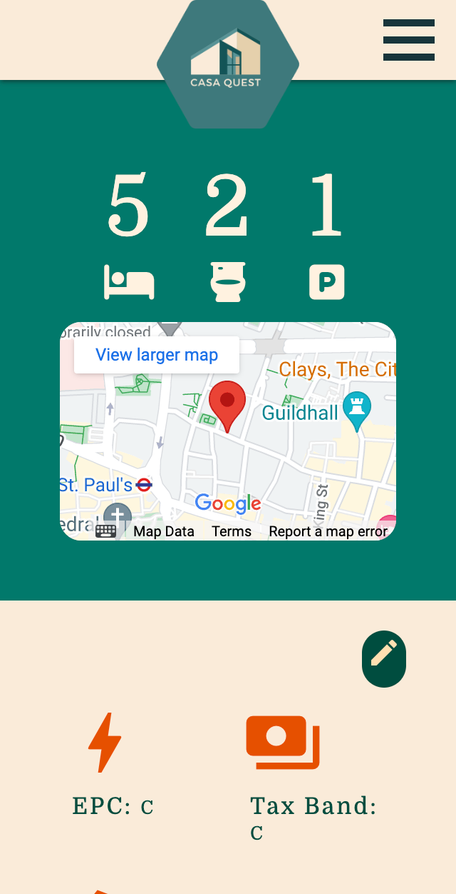 |  |  | Works as expected |
| Tablet DevTools (768px) | |   | |  |  ||  | works as expected |
| Desktop | |  | |   |   |  |  | Works as expected |
| Iphone 13 (Own device) | 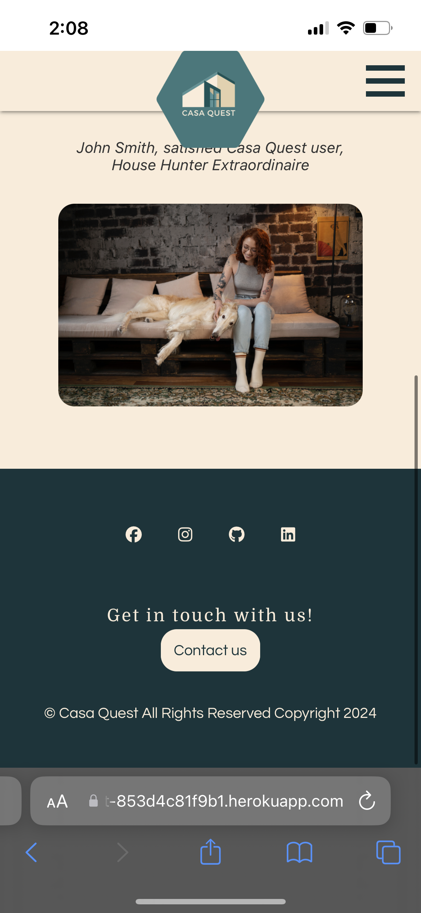 |  | | 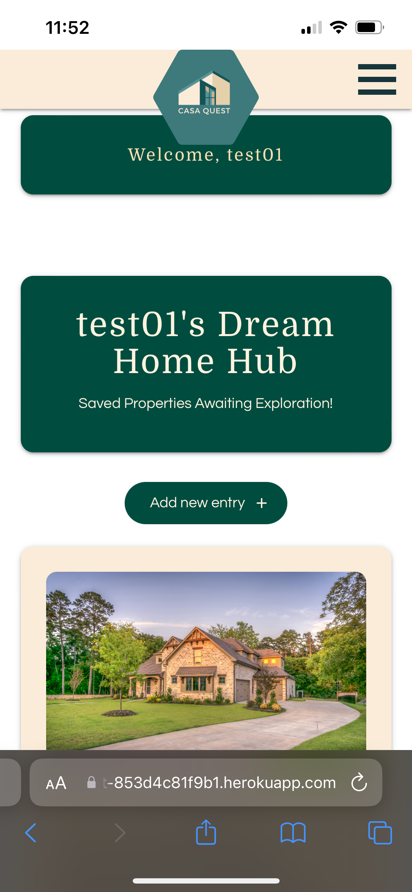 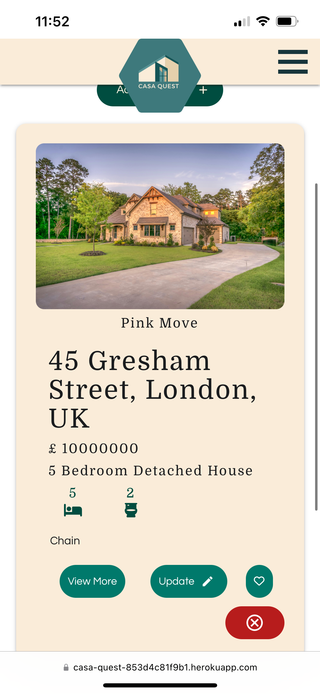  |   |  | 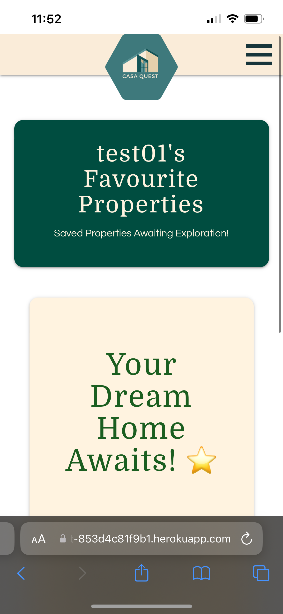  | Flash can be obscured by logo |

| Browser | New House | Edit new house | Change Password  | Manage_users | 404 | 500 | 403 | Notes |
| --- | --- | --- | --- | --- | --- | --- | --- | --- |
| Mobile DevTools (320px) ||   | | 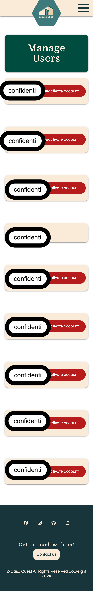 |  ||  | works as expected |
| Tablet DevTools (768px) | |   | |  |  ||  | works as expected |
| Desktop |  |   | |  |  ||  | works as expected |
| Iphone13 (Own device) |  |   | |  | 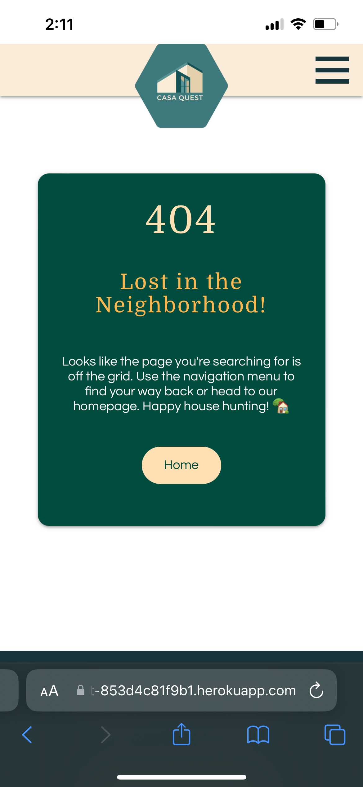 ||  | works as expected |


## Lighthouse Audit

I've tested my deployed project using the Lighthouse Audit tool to check for any major issues.

| Page | Mobile | Desktop | Notes |
| --- | --- | --- | --- |
| Landing |  |  | Initially warning on performance level due to image sizes too big. I have compressed the images now and the performance level have become better |
| Register |  |  | No issues |
| Login | 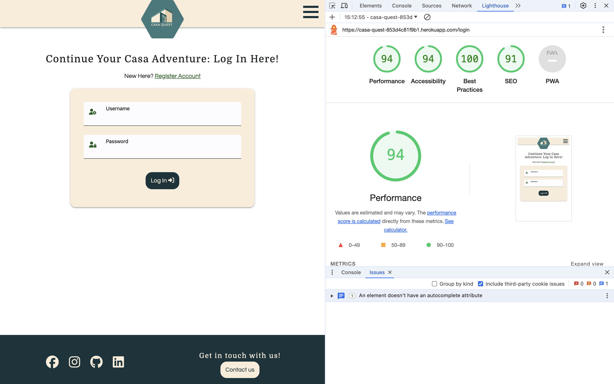 |  | Slow response time due to large images |
| Profile |  | 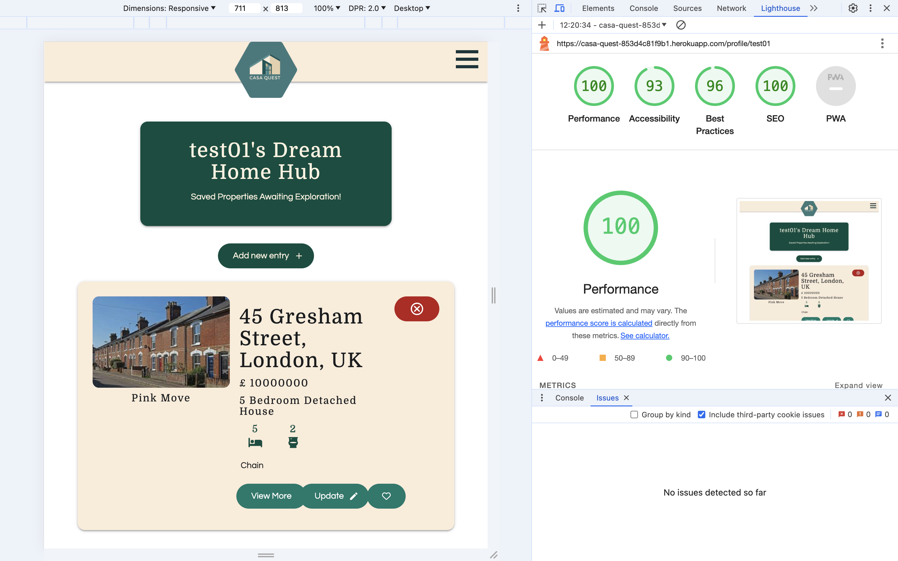 | Warnings on accessbility due to lack of name for button. Fix: added aria-label to fabourite button. Screenshots are the fixed version |
| House |  | 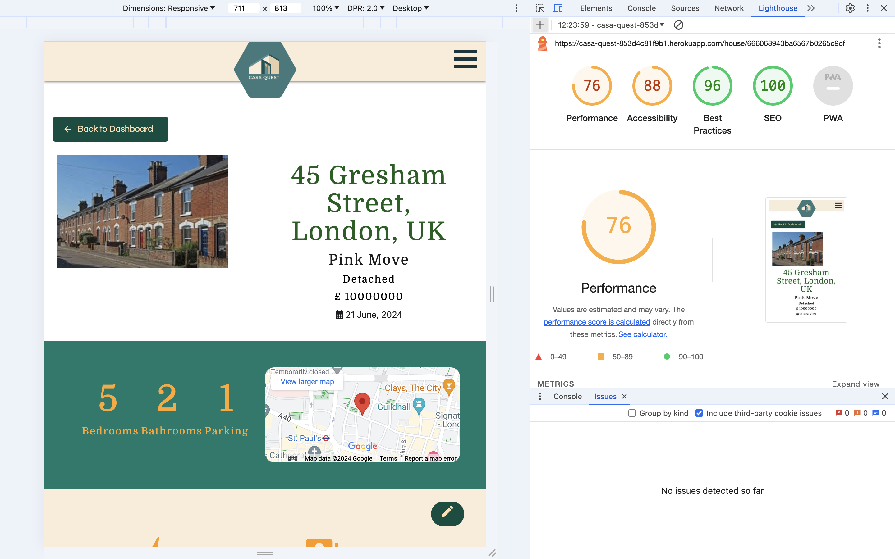 | Accessibility due to links |
| Contact |  |  | No Issues |
| Favourites | 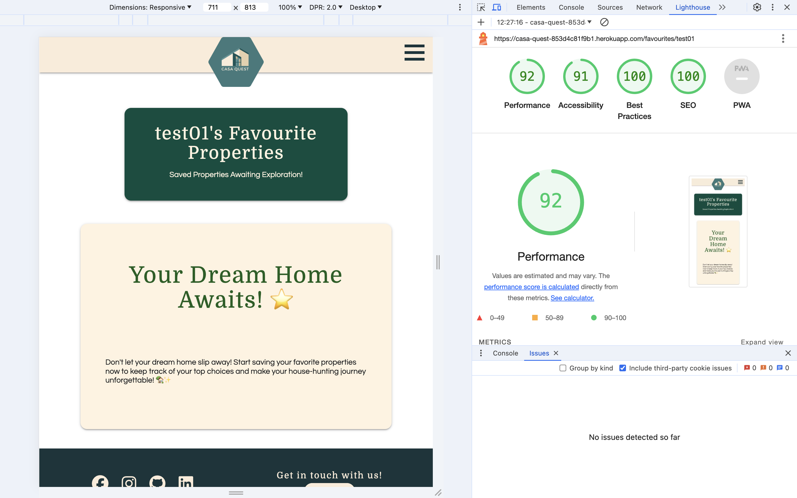 |  | No issues |
| New Entry |  |  | Initial warnings on accessbility where some form elements did not have a form. Fix: Add aria-label to those form elements. the screenshots are the update fix version |
| Edit House |  |  | No Issues |
| Change Password |  |  | No issues |
| Manage Users |  | 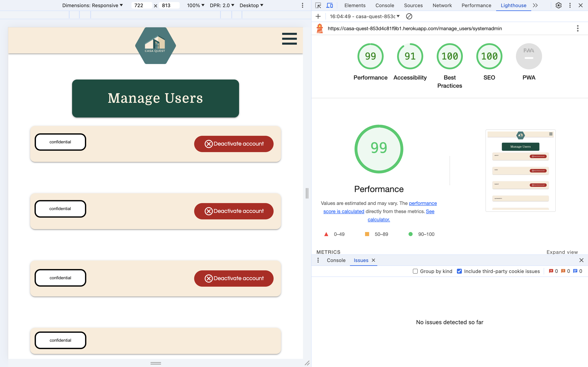 | No issues |
| 404 |  |  | No Issues|
| 500 |  |  | No Iss8es |
| 403 |  |  | No Issues |

## Defensive Programming

Defensive programming was manually tested with the below user acceptance testing:

| Page | Expectation | Test | Result | Fix | Screenshot |
| --- | --- | --- | --- | --- | --- |
| New_house | | | | | |
| | Users cannot submit an empty form | Tested the form by submitting an empty form by removing the `required` if a bad users do so. | Form validation worked and an error message appeared | Test concluded and passed |  |
| | Users cannot submit an image that is larger than 10mb to cloudinary | Tested the form by submitting an image that is 15mb | Form was submitted but a placeholder image was instead used and a flash message of error of 'uploading image' | Test concluded and passed |  |
| Edit_new_house | | | | | |
| | Users cannot submit an empty form |Tested the form by submitting an empty form by removing the `required` if a bad users do so.  | Form validation worked and an error message appeared | Test concluded and passed |  |
| | Users cannot submit an image that is larger than 10mb to cloudinary | Tested the form by submitting an image that is 15mb | Form was submitted but no change to the image was made | Test concluded and passed |  |
| House | | | | | |
| | Users cannot submit an empty form |Tested the all the form by submitting an empty form by removing the `required` if a bad users do so.  | Form validation worked and an error message appeared | Test concluded and passed |  
|
| Manage Users | | | | | |
| | Users that is not 'systemadmin' will not be able to access manage users | Tested the feature by brute forcing the url | The feature behaved as expected and I was redirected to a 403 page | Test concluded and passed |  |
| User Access | | | | | |
| | User should not be able to access other user's dashboard | Tested the feature by brute forcing the url | The feature behaved as expected and I was redirected back to profile | Test concluded and passed | 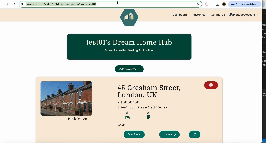 |
| | User should not be able to access other user's houses | Tested the feature by brute forcing the url | The feature behaved as expected and I was redirected back to profile | Test concluded and passed |  |
| |Users cannot perform CRUD functionality while logged-out | Tested the feature by brute forcing the url while user is logged out | The feature behaved as expected and I was redirected back to logged in page | Test concluded and passed |  |
| Index Page | | | | | |
| | If user has not logged in or registered, call out button should lead to register page | Tested the feature by doing clicking the button | The feature behaved as expected,| Test concluded and passed |  |
| | If user is logged in, call out button should lead to profile | Tested the feature by doing clicking the button | The feature behaved as expected,| Test concluded and passed |  |
| House | | | | | |
| | If user edits an information that doesnt exist, user is redirected to a 404 page | Tested the feature updating before adding information | The feature behaved as expected,| Test concluded and passed |  |


## User Story Testing


| User Story | Screenshot |
| --- | --- |
| As a new site user, I would like to see a clear logo, so that I can remember the brand. |  |
| As a new site user, I would like to see a clear message of the web app, so that I can understand the web applicatioon well.|   |
| As a new site user, I would like to see navigation bar, so that I can easily navigate around the site. |  |
|  As a new site user, I would like to see a contact page, so that I can get in touch with the administrators of the application if I need help. |  |
|  As a new site user, I would like to see social media icons so that I can reach out at the other sources.|  |
| As a returning site user, I would like to be able to register, so that I can have a personal account |  |
| As a returning site user, I would like to be able to make new entries of properties, so that I can keep a log of my properties. |  |
| As a returning site user, I would like to edit the information, so that I can have a more accurate information on the property. |  |
| As a returning site user, I would like to delete the entry, so that I can eliminate properties that I'm not interested. |  |
| As a returning site user, I would like to see a community of homebuyers, so that I can learn more about buying houses. | Future feature |
| As a returning site user, I would like to be able to make a post in the community of homebuyers, so that I can share my experience. | Future feature |
| As a returning site user, I would like to be able to make a comment in a post in the community of homebuyers, so that I can share my experience. | Future feature |
| As a returning site user, I would like to be able to see all the properties that I have added in one page so I can easily compare them | |
| As a returning site user, I would like to be able to mark some properties as my favourite so that I can keep track of my top choices | |
| As a returning site user, I would like the ability to access a dedicated page for each house, allowing me to add and view detailed information specific to that property. | |
| As a returning site user, I would like the ability to add information on that specific property | |
| As a returning site user, I would like the ability to edit information on that specific property | |
| As a returning site user, I would like to be able to see a map of the location of the house so I can see the facilities nearby | |
| As a returning site user, I would like to be able to log out to keep my session secure from who will be using the same device as me | |
| As a returning site user, I would like to be able to change my password, so that I can keep my account secure | |
| As a site administrator, I would like to keep connected with my users , so that they can report any user experience. |  |
| As a site administrator, I should be able to view who created the house post so I can monitor the content and account| |
| As a site administrator, I need to manage and view user accounts effectively to ensure control over the user base and monitor user activity.| |
| As a site administrator, I should be able to delete posts that is against the rules, so that I can ensure that the community is safe. | Future feature |
| As a site administrator, I should be able to delete users that is violating the rules, so that I can ensure that the community is safe. |   |
| As a site administrator, I should be able to direct users back to home if they have reached a page that is not found |   |
| As a site administrator, I should be able to direct users back to home if they have reached a page that is forbidden to access. |   |
| As a site administrator, I should be able to direct users back to home if the web application have reached an internal server error.|   |


## Automated Testing

I have not conducted automated tests on my application because it was not suitable. Jest, the testing framework for JavaScript, does not handle event handlers effectively, and many of my JavaScript functions rely on external libraries such as Materialize.

I have researched methods for automated testing with Flask and Python, and found that using Flask-Pytest could be a viable option. However, the more I delved into it, the more complex and challenging it seemed.

I fully acknowledge and understand that, in a real-world scenario, an extensive set of additional tests would be more comprehensive.

## Bugs

- Tooltipped buttons posting data and making duplicate id.
    
    

    - To address this issue, I conducted research and found that the default type of a button is set to submit, as discussed on [Stack Overflow](https://stackoverflow.com/questions/41904199/whats-the-point-of-button-type-button). Consequently, I added `type="button"` to ensure that the button's behavior aligns with our intentions. Additionally, I implemented defensive measures to prevent duplicate ID post requests.

        ```python
            if house_data is None:
                mongo.db.houseChecks.insert_one(add_house_check_info)
                flash("Personal House Checks Added")
                return redirect(url_for("view_house", house_id=house_id))
            error_message = "House Check Information already exists"
            return render_template("500.html", error_message=error_message)
        ```

- Checkboxes are not being filled.
    

    - To resolve this issue, I discovered that I had duplicate IDs for checkbox elements, causing interference with their functionality. I rectified this by adjusting the IDs of the duplicate elements, resulting in the proper functioning of the checkboxes.

- Unable to log in.

    

    - To fix this issue, I realised that I have set the code to be:
        `"password": generate_password_hash("password")`

    - Therefore, I changed the password from a string back to a variable:

        `"password": generate_password_hash(password)`


- White space appearing below footer only on Firefox mobile device.
    
    

    - The `top: 100vh;` property places the footer 100% down from the top of the viewport, positioning it at the bottom of the visible area. However, this did not make any changes.

        ```css
        body > footer {
            position: sticky;
            top: 100vh;
        }
        ```
    - Added padding-bottom to main to increase content and push footer down on smaller devices. It did not make any changes
        ```css
        main {
            padding-bottom: 10vh;
            }
        ```
    - **FIX** After researching more, I came across to a explanation of the error from [StackOverflow](https://stackoverflow.com/questions/14510899/white-space-after-the-footer-only-in-firefox-and-ie). It turns out that the firefox gives less bottom margin to headings. After testing the margins in my footer elements, This caused the elements to overflow whic gave me the idea to change the height of my footer to `min-height` of 30vh to make it more responsive.


## Unfixed Bugs

> [!NOTE]  
> There are no remaining bugs that I am aware of.
